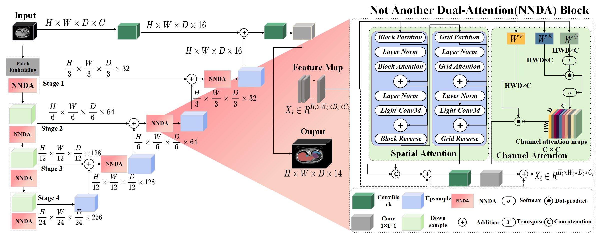

# NNDA-UNETR: A Plug-and-Play Parallel Dual Attention Block in U-Net with Enhanced Residual Blocks for Medical Image Segmentation

## Graphical abstract of NNDA-UNETR

- A novel dual attention approach achieves a new State-of-the-Art (SOTA) in abdominal multi-organ and cardiac segmentation tasks.
- The lightweight design of the model makes it more feasible for application in specific medical scenarios.
- Modular design helps researchers achieve segmentation performance without investing significant effort in complex model design.

## Architecture overview of NNDA-UNETR
Our NNDA-UNETR approach demonstrates the hierarchical architecture. Initially, the encoder receives 3D tensors (patches), and their outputs establish connections with the decoder using standard skip connections. Subsequently, conv-blocks generate the final segmentation output. Our design innovation lies in the incorporation of the Not Another Dual Attention (NNDA) block, which efficiently learns enhanced spatial-channel feature representations. This is achieved by employing parallel attention modules to perform two tasks simultaneously. The right-side NNDA block diagram depicts this mechanism. The spatial attention module integrates local and global attention mechanisms along with a lightweight block called Light-conv3d. Additionally, the second attention module highlights channel dependencies to produce channel attention maps. By merging the outputs from both attention modules and enhancing feature representation through conv-blocks, it leads to improved segmentation masks.

## Results

### BTCV Dataset

A qualitative assessment of the multi-organ segmentation task is conducted. Our proposed NNDA-UNETR is compared with current approaches, including UNETR, SwinUNETR, nnFormer, and UNETR++. It is observed that the existing methods encounter difficulties in accurately segmenting various organs, as indicated by the organs highlighted within the white and yellow dashed boxes. (The white boxes represent under-segmented regions, while the yellow boxes denote over-segmented regions.) In contrast, our NNDA-UNETR demonstrates promising segmentation performance by precisely delineating the organs. We recommend viewing the image in zoom for a more detailed analysis.

### ACDC Dataset

We aim to visually compare the capability of NNDA-UNETR, UNETR++, and nnFormer in the context of ACDC for Automatic Cardiac Diagnosis. Along with showcasing segmentation results, we will provide ground truth masks for an improved comparative analysis.

## Acknowledgement
This repository is built based on [Swin UNETR](https://github.com/Project-MONAI/research-contributions/tree/main/SwinUNETR), [nnFormer](https://github.com/282857341/nnFormer) and [UNETR++](https://github.com/Amshaker/unetr_plus_plus) repository.
